# 📐 Architecture Complète - Codiny Platform

Ce document contient tous les diagrammes pour comprendre l'architecture complète de l'application **Codiny - Driving Exam Platform**.

---

## 🏗️ 1. Architecture Système Globale

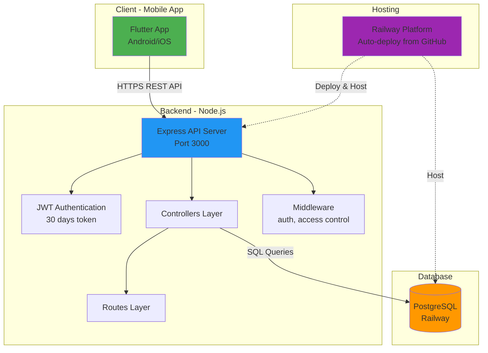

**Explication** :
- **Flutter App** : Interface utilisateur mobile (Android/iOS)
- **Express API** : Backend Node.js qui gère toute la logique métier
- **JWT Token** : Authentification sécurisée (durée 30 jours)
- **PostgreSQL** : Base de données relationnelle
- **Railway** : Hébergement cloud avec déploiement automatique

---

## 🗄️ 2. Modèle de Base de Données (Schema ER)

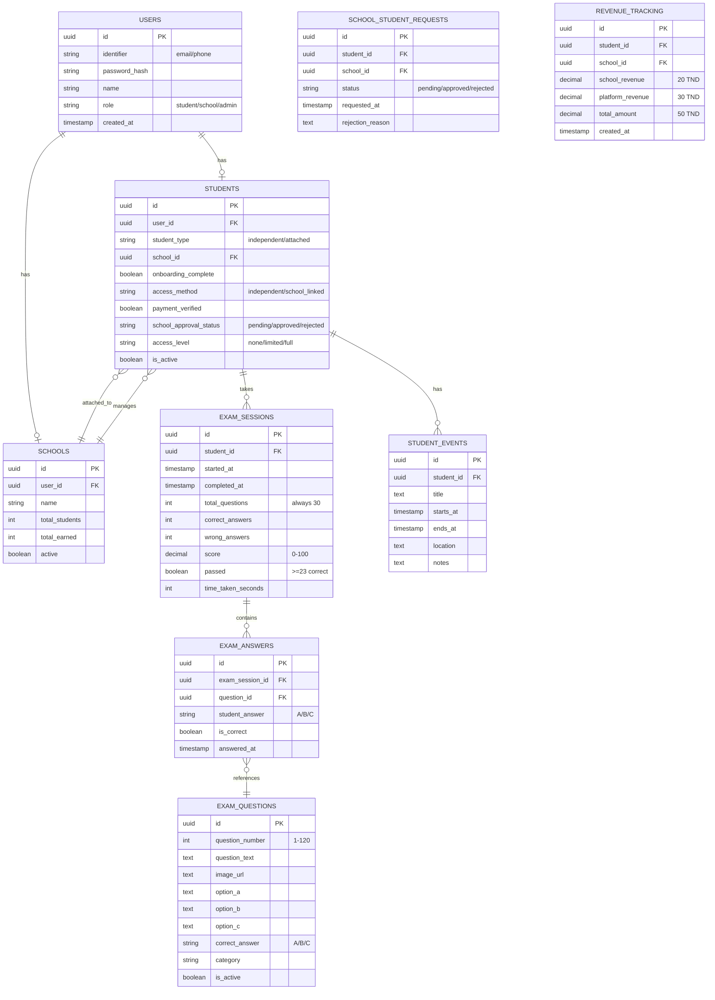

**Tables principales** :
- **users** : Tous les comptes (étudiants, écoles, admins)
- **students** : Profils étudiants avec accès et abonnements
- **schools** : Profils auto-écoles
- **exam_questions** : Banque de 120 questions
- **exam_sessions** : Chaque tentative d'examen (30 questions)
- **exam_answers** : Réponses détaillées question par question
- **student_events** : Calendrier/événements des étudiants

---

## 🔄 3. Flux d'Authentification (Sequence Diagram)

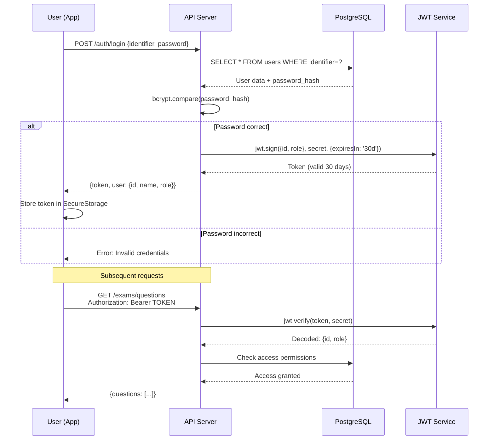

**Durée du token** : **30 jours** (au lieu de 1 heure avant)

---

## 📱 4. Flux de Passage d'Examen

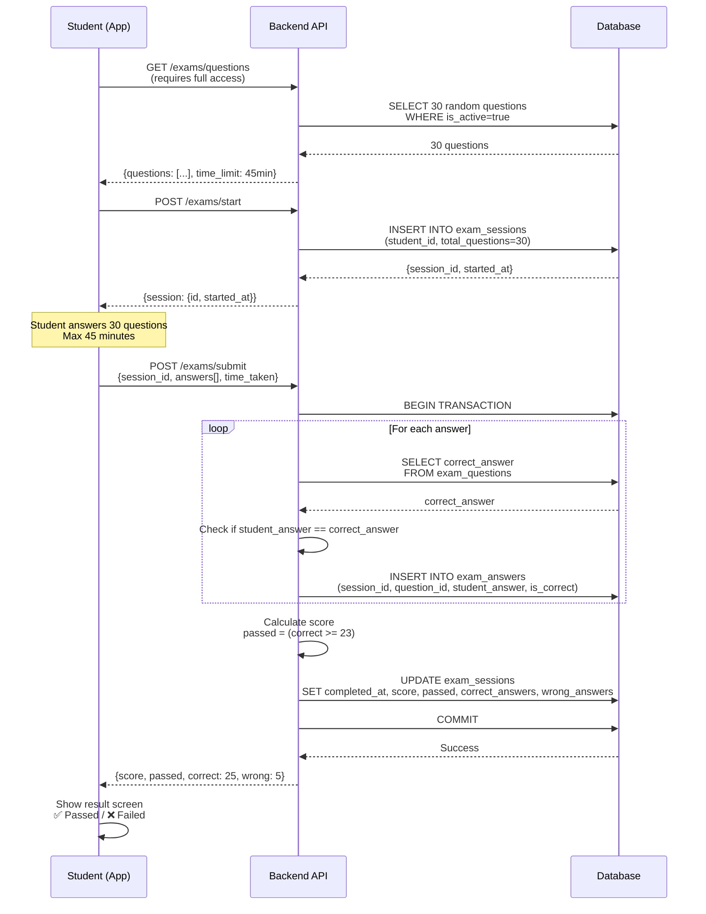

**Règle de passage** : **23/30 correct (76.67%)** minimum

---

## 🏫 5. Système École-Étudiant (Use Case Diagram)

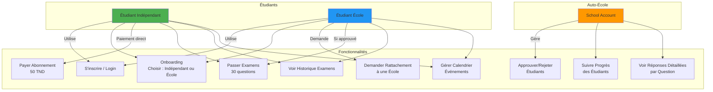

**Deux types d'accès** :
1. **Étudiant Indépendant** : Paie 50 TND directement → accès immédiat
2. **Étudiant École** : Demande rattachement → école approuve → accès gratuit (école paie 50 TND : 20 TND école + 30 TND plateforme)

---

## 🔐 6. Contrôle d'Accès (Access Control Flow)

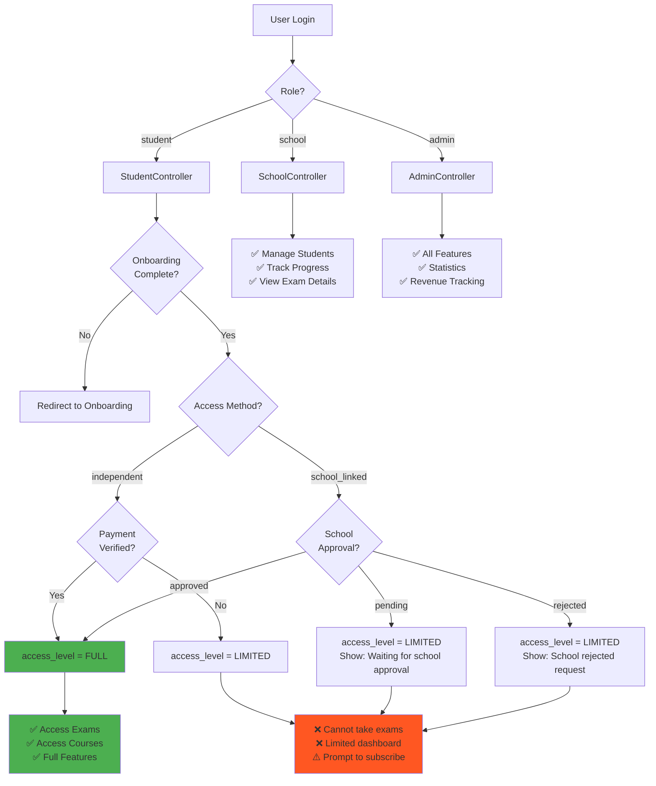

**Niveaux d'accès** :
- **FULL** : Peut passer les examens et accéder à tout
- **LIMITED** : Dashboard only, doit payer/être approuvé
- **NONE** : Doit compléter onboarding

---

## 🌐 7. API Routes (Backend Endpoints)

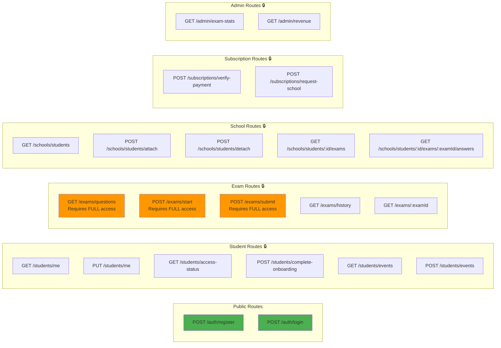

**🔒** = Requires JWT Token Authentication  
**Requires FULL access** = Needs payment verified OR school approved

---

## 📲 8. Frontend Architecture (Flutter App)

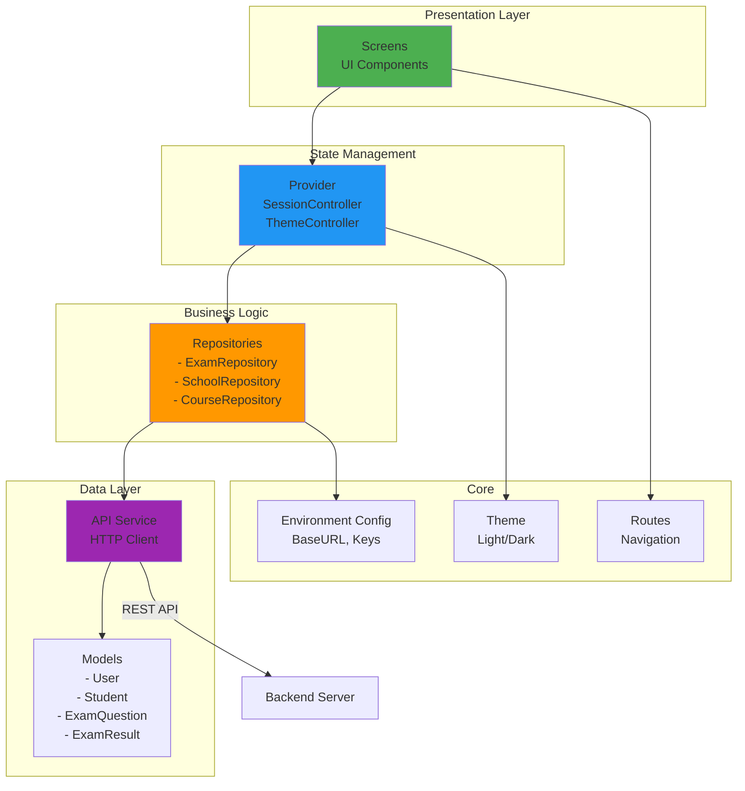

**Structure du code Flutter** :
```
lib/
├── app/              # App entry, theme, router
├── core/             # Config, constants
├── data/
│   ├── models/       # Data classes
│   ├── repositories/ # Business logic
│   └── services/     # API calls
├── features/         # Screens par fonctionnalité
│   ├── auth/
│   ├── dashboard/
│   ├── exams/
│   └── onboarding/
├── shared/           # Widgets réutilisables
│   ├── layout/
│   ├── ui/
│   └── widgets/
└── state/            # State management (Provider)
```

---

## 🎯 9. Flux Complet : Étudiant Indépendant

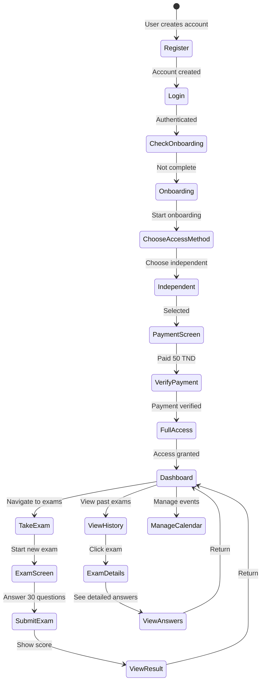

---

## 🏫 10. Flux Complet : Étudiant École

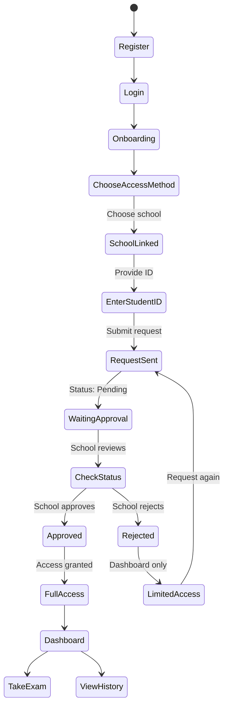

---

## 📊 11. Diagramme de Classes Simplifié

```mermaid
classDiagram
    class User {
        +String id
        +String identifier
        +String name
        +String role
        +String passwordHash
        +login()
        +register()
    }
    
    class Student {
        +String id
        +String userId
        +String studentType
        +String accessMethod
        +Boolean paymentVerified
        +String schoolApprovalStatus
        +String accessLevel
        +Boolean isActive
        +completeOnboarding()
        +verifyPayment()
        +requestSchoolLink()
    }
    
    class School {
        +String id
        +String userId
        +String name
        +Int totalStudents
        +Int totalEarned
        +approveStudent()
        +rejectStudent()
        +getStudents()
        +trackProgress()
    }
    
    class ExamQuestion {
        +String id
        +Int questionNumber
        +String questionText
        +String imageUrl
        +String optionA
        +String optionB
        +String optionC
        +String correctAnswer
        +String category
    }
    
    class ExamSession {
        +String id
        +String studentId
        +DateTime startedAt
        +DateTime completedAt
        +Int totalQuestions
        +Int correctAnswers
        +Int wrongAnswers
        +Double score
        +Boolean passed
        +start()
        +submit()
        +calculateScore()
    }
    
    class ExamAnswer {
        +String id
        +String examSessionId
        +String questionId
        +String studentAnswer
        +Boolean isCorrect
        +DateTime answeredAt
    }
    
    User "1" -- "0..1" Student : has
    User "1" -- "0..1" School : has
    Student "1" -- "*" ExamSession : takes
    School "1" -- "*" Student : manages
    ExamSession "1" -- "*" ExamAnswer : contains
    ExamAnswer "*" -- "1" ExamQuestion : references
```

---

## 🔄 12. Gestion des Erreurs et Token Expiration

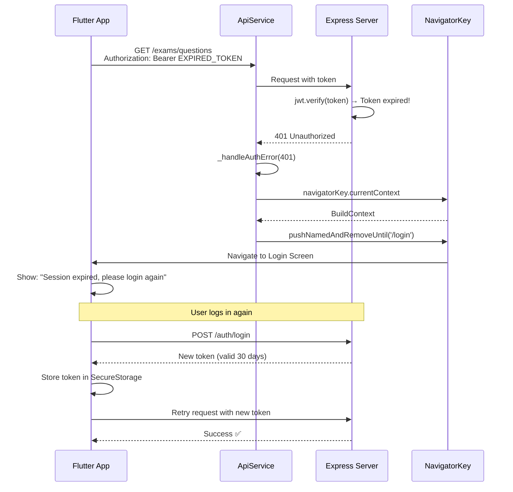

**Fix implémenté** : Au lieu de lancer une exception, l'app redirige automatiquement vers login.

---

## 📈 13. Statistiques et Reporting (School Dashboard)

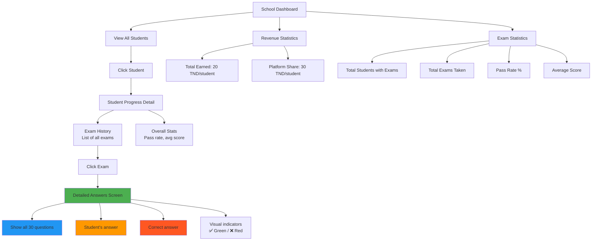

---

## 🛠️ 14. Technologies et Stack

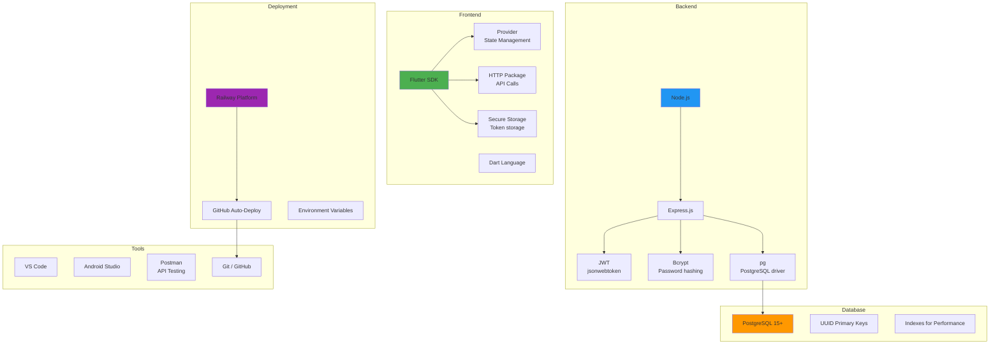

---

## 📝 15. Résumé des Fonctionnalités Principales

### Pour les Étudiants :
- ✅ Inscription / Connexion
- ✅ Onboarding (choix accès indépendant ou école)
- ✅ Passer des examens (30 questions, 45 minutes)
- ✅ Voir historique des examens avec scores
- ✅ Calendrier d'événements
- ✅ Dashboard personnalisé

### Pour les Auto-Écoles :
- ✅ Gérer la liste des étudiants
- ✅ Approuver/Rejeter les demandes
- ✅ Voir le progrès détaillé de chaque étudiant
- ✅ Voir tous les examens d'un étudiant
- ✅ Voir les réponses détaillées question par question
- ✅ Statistiques de revenus
- ✅ Dashboard de statistiques

### Pour les Admins :
- ✅ Voir statistiques globales
- ✅ Gérer les revenus
- ✅ Voir statistiques des examens

---

## 🔒 16. Sécurité Implémentée

- ✅ **JWT Tokens** : 30 jours de validité
- ✅ **Bcrypt** : Hash des mots de passe
- ✅ **Middleware d'authentification** : Toutes les routes protégées
- ✅ **Contrôle d'accès** : Vérification des permissions (FULL/LIMITED)
- ✅ **Validation des entrées** : Côté backend
- ✅ **CORS configuré** : Protection contre les requêtes non autorisées
- ✅ **Token expiration handling** : Redirection automatique vers login
- ✅ **School ownership verification** : Une école ne peut voir que ses étudiants

---

## 📦 17. Déploiement et CI/CD

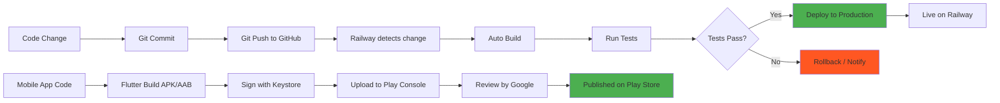

---

## 🎨 18. UI/UX Flow (Screens)

### Écrans principaux :
1. **Splash Screen** → **Login** → **Register**
2. **Onboarding** (3 étapes : Bienvenue → Choix accès → Configuration)
3. **Dashboard Étudiant** (Stats, Quick actions, Calendar)
4. **Exams Screen** (Start new exam, History)
5. **Exam Taking Screen** (30 questions, timer, navigation)
6. **Exam Result Screen** (Score, Pass/Fail, Review)
7. **Exam History Screen** (List of all exams)
8. **Exam Answers Detail** (Question-by-question review)
9. **Calendar Screen** (Events management)
10. **Dashboard École** (Students list, Stats)
11. **Student Progress Detail** (Exam history, Stats)
12. **Payment Screen** (Independent students)

---

## 🚀 19. Performance Optimizations

- ✅ **Database Indexes** : Sur les colonnes fréquemment requêtées
- ✅ **Pagination** : Pour les listes longues (exams history)
- ✅ **Lazy Loading** : Chargement des images à la demande
- ✅ **Caching** : Provider state management garde l'état
- ✅ **Connection Pooling** : PostgreSQL pool pour réutiliser les connexions
- ✅ **JWT Token Long Duration** : Réduit les re-authentifications

---

## 📖 Guide d'Utilisation des Diagrammes

### Visualiser les diagrammes Mermaid :

#### Option 1 : VS Code Extension
1. Installe l'extension **"Markdown Preview Mermaid Support"**
2. Ouvre ce fichier dans VS Code
3. Ctrl+Shift+V pour voir le preview

#### Option 2 : Mermaid Live Editor
1. Va sur https://mermaid.live
2. Copie/colle le code Mermaid
3. Télécharge en PNG/SVG

#### Option 3 : GitHub
1. Pousse ce fichier sur GitHub
2. GitHub affiche automatiquement les diagrammes Mermaid

---

## 📞 Contact & Support

Pour toute question sur l'architecture :
- Consulte le code source dans les dossiers `backend/` et `codiny_platform_app/`
- Regarde les fichiers de documentation dans le root du projet
- Check les commentaires dans le code

---

**Version** : 1.0  
**Date** : 2026-01-13  
**Auteur** : Documentation générée pour Codiny Platform
